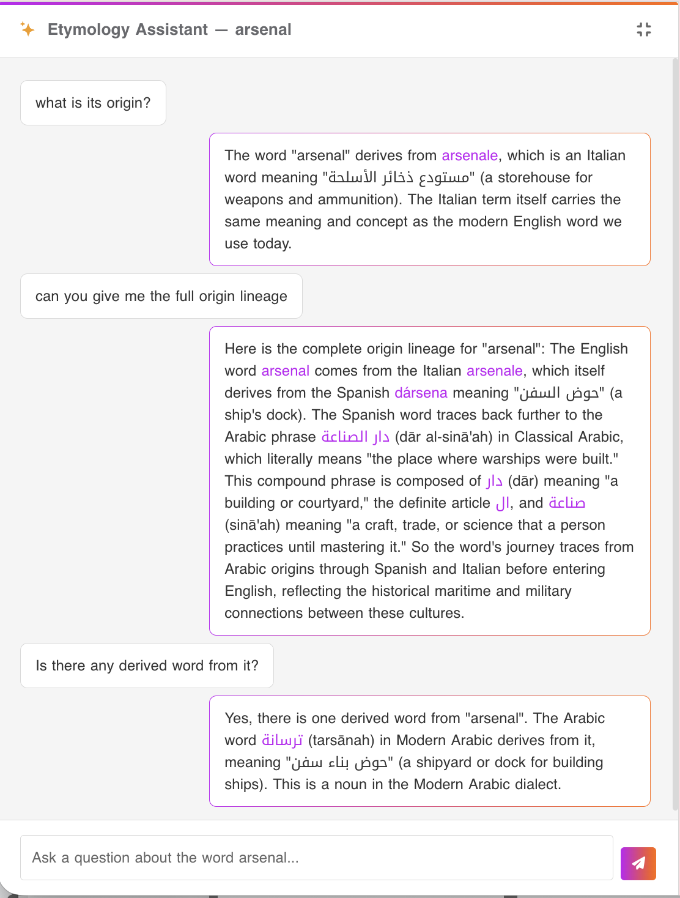
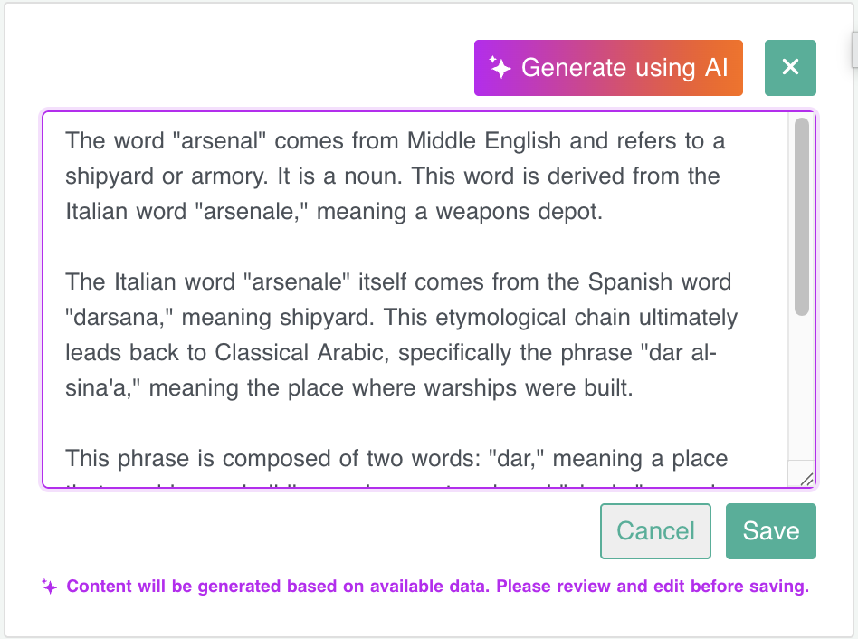
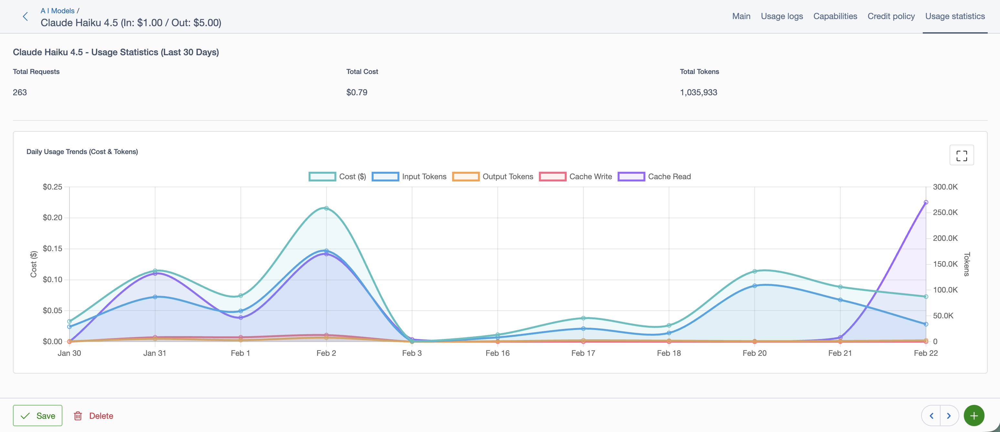
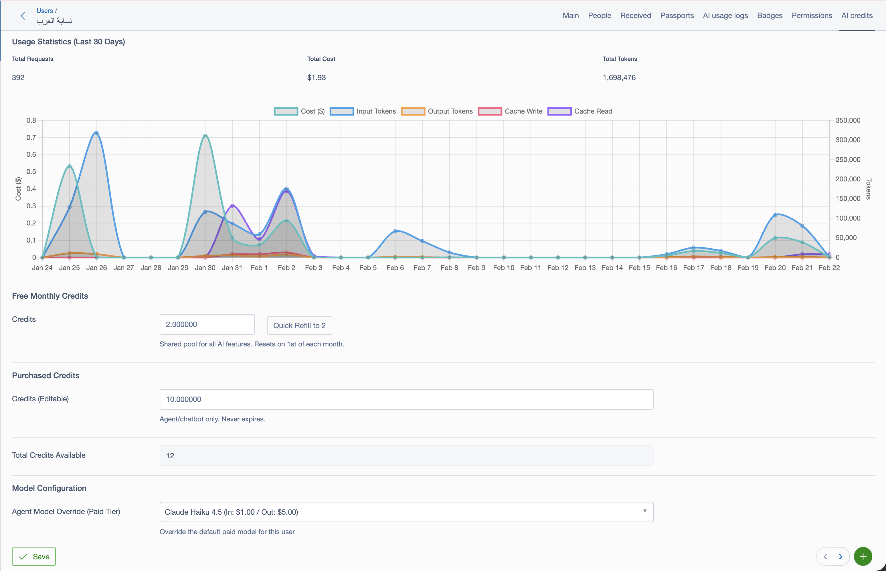

# silverstripe-ai

AI-powered features for SilverStripe 5: a context-aware chatbot agent and a human-in-the-loop content generation
system.

```bash
composer require hudhaifas/silverstripe-ai
```

---

## What you get out of the box

- **Agent Widget** — a chat sidebar that knows which DataObject the user is viewing, can call tools to read or
  write data, and asks for confirmation before making changes
- **Content Widget** — generate AI content for any DataObject field with mandatory user review before saving
- **REST API** — endpoints under `/api/ai/agent` and `/api/ai/content`
- **Human-in-the-Loop (HITL)** — write tools and content generation pause for user approval
- **Zero-dependency storage** — conversation history and workflow state use SilverStripe's built-in cache; swap to
  Redis with one YAML line
- **Multi-provider** — OpenAI and Anthropic (with prompt caching for up to 90% cost reduction)
- **Credit system** — free monthly credits + purchasable credits per member, with automatic model tier selection
- **Usage logging** — every request logged with token counts, cost, and cache metrics

---

## How it works

### Agent Widget

```
Browser → POST /api/ai/agent/chat
            ↓
       AgentController
            ↓
       AgentService  ←→  MemberAIExtension (credit check + model selection)
            ↓
       AgentFactory  →  YourCustomAgent (extends DataObjectAgent)
            ↓
       NeuronAI  ←→  OpenAI / Anthropic
            ↓
       [tool called that writes data]
            ↓
       WorkflowInterrupt → returns resumeToken to browser
            ↓
       User approves/rejects in UI
            ↓
       POST /api/ai/agent/resume → tool executes → LLM responds
```

### Content Widget

```
Browser → POST /api/ai/content/generate
            ↓
       ContentController
            ↓
       ContentService  ←→  MemberAIExtension (credit check + model selection)
            ↓
       ContentWorkflow
            ↓
       AgentRunnerNode → GenerateContentAgent → LLM
            ↓                     ↓
            ↓         YourContentExtension (prompt + input data)
            ↓
       ReviewContentNode → WorkflowInterrupt (HITL)
            ↓
       User approves/edits/rejects in UI
            ↓
       POST /api/ai/content/resume
            ↓
       PersistContentNode → entity.saveContent()
                                   ↓
                      YourContentExtension (save logic)
```

---

## Quick start

### 1. Install

```bash
composer require hudhaifas/silverstripe-ai
vendor/bin/sake dev/build flush=1
```

Set your API keys in `.env`:

```dotenv
OPENAI_API_KEY=sk-...
ANTHROPIC_API_KEY=sk-ant-...
```

### 2. Configure default models in the CMS

Go to Settings → AI and pick a free-tier model (e.g. `gpt-4o-mini`) and a paid-tier model (e.g.
`claude-sonnet-4-5`). Models are seeded automatically on `dev/build`.

---

## What's auto-configured

The module auto-applies these via YAML — no manual setup required:

| Component               | Auto-applied to                                | Purpose                                            |
|-------------------------|------------------------------------------------|----------------------------------------------------|
| `MemberAIExtension`     | `Member`                                       | Credit management, model selection, usage tracking |
| `SiteConfigAIExtension` | `SiteConfig`                                   | Default model configuration in Settings → AI       |
| API routes              | `/api/ai/agent/*`, `/api/ai/content/*`         | REST endpoints                                     |
| Cache backends          | `ChatHistoryInterface`, `PersistenceInterface` | Conversation history + HITL state                  |

You only need to create your custom agents, tools, and content extensions.

---

## Agent Widget



### 1. Create your agent

```php
use Hudhaifas\AI\Agent\DataObjectAgent;
use NeuronAI\Agent\Middleware\ToolApproval;
use NeuronAI\Agent\Nodes\ToolNode;

class ProductAgent extends DataObjectAgent
{
    // Cached by Anthropic for 5 min — put stable rules and tool descriptions here.
    // For OpenAI this is just the first part of the system prompt.
    protected function getStaticInstructions(): string
    {
        return 'You are a helpful assistant for managing products.
                Use the available tools to read and update product data.
                Always confirm with the user before making changes.';
    }

    // Injected fresh on every request — current entity state, date, session info.
    // Not cached, so keep it concise.
    protected function getDynamicContext(): string
    {
        $product = $this->contextEntity; // the DataObject passed from the controller
        return "Current product: {$product->Title} (ID: {$product->ID})\n"
             . "Price: {$product->Price}\n"
             . "Stock: {$product->Stock}";
    }

    // All tools the LLM can call. Read-only tools run immediately;
    // write tools are gated by ToolApproval in middleware() below.
    public function tools(): array
    {
        return [
            new GetProductDetailsTool(),   // read — runs freely
            new UpdateProductPriceTool(),  // write — requires user approval
            new DeleteProductTool(),       // write — requires user approval
        ];
    }

    // ToolApproval intercepts the listed tools before execution and returns
    // a resume_token to the frontend. The agent pauses until the user
    // approves or rejects via POST /api/ai/agent/resume.
    protected function middleware(): array
    {
        return [
            ToolNode::class => [
                new ToolApproval(tools: [
                    UpdateProductPriceTool::class,
                    DeleteProductTool::class,
                ]),
            ],
        ];
    }
}
```

### 2. Register the mapping

```yaml
# _config/agent.yml
Hudhaifas\AI\Factory\AgentFactory:
  agent_mappings:
    MyApp\Model\Product: 'MyApp\Agent\ProductAgent'
```

### 3. Add the widget to your page

```yaml
# _config/extensions.yml
MyApp\Controller\ProductPageController:
  extensions:
    - Hudhaifas\AI\Extension\AgentRequirementsExtension
```

Include `$AgentWidget` in your template and the JS/CSS loads automatically.

**Template example:**

```html
<%-- In your Page.ss or ProductPage.ss template --%>
<div class="product-detail">
    <h1>$Title</h1>
    <p>$Description</p>

    <%-- Agent widget uses the current page's $ClassName, $ID, $Title automatically --%>
    <% include AgentWidget %>
</div>
```

The widget reads `data-entity-class`, `data-entity-id`, and `data-entity-name` from the template context.

### 4. Create tools

Tools are PHP classes that the LLM can call. Each tool defines its name, description, parameters, and execution
logic.

**Read-only tool** (runs immediately):

```php
use NeuronAI\Tools\Tool;
use NeuronAI\Tools\PropertyType;
use NeuronAI\Tools\ToolProperty;

class GetProductDetailsTool extends Tool
{
    public function __construct()
    {
        parent::__construct(
            name: 'GetProductDetails',
            description: 'Get full details of a product including price, stock, and description.',
            properties: [
                new ToolProperty(
                    name: 'product_id',
                    type: PropertyType::INTEGER,
                    description: 'The ID of the product to retrieve.',
                    required: true
                ),
            ]
        );
    }

    public function __invoke(int $product_id): string
    {
        $product = Product::get()->byID($product_id);
        
        if (!$product) {
            return json_encode(['success' => false, 'error' => 'Product not found']);
        }

        return json_encode([
            'success' => true,
            'product' => [
                'id' => $product->ID,
                'title' => $product->Title,
                'price' => $product->Price,
                'stock' => $product->Stock,
            ],
        ]);
    }
}
```

**Write tool** (requires HITL approval):

```php
use NeuronAI\Tools\Tool;
use NeuronAI\Tools\PropertyType;
use NeuronAI\Tools\ToolProperty;
use SilverStripe\Security\Security;

class UpdateProductPriceTool extends Tool
{
    public function __construct()
    {
        parent::__construct(
            name: 'UpdateProductPrice',
            description: 'Update the price of a product.',
            properties: [
                new ToolProperty('product_id', PropertyType::INTEGER, 'Product ID', true),
                new ToolProperty('new_price', PropertyType::NUMBER, 'New price in dollars', true),
            ]
        );
    }

    // Optional: human-readable summary for the HITL confirmation card
    public static function summarise(array $inputs): string
    {
        $id = $inputs['product_id'] ?? '?';
        $price = $inputs['new_price'] ?? '?';
        return "Update product #{$id} price to \${$price}";
    }

    public function __invoke(int $product_id, float $new_price): string
    {
        $member = Security::getCurrentUser();
        $product = Product::get()->byID($product_id);

        if (!$product) {
            return json_encode(['success' => false, 'error' => 'Product not found']);
        }

        if (!$product->canEdit($member)) {
            return json_encode(['success' => false, 'error' => 'Permission denied']);
        }

        $oldPrice = $product->Price;
        $product->Price = $new_price;
        $product->write();

        return json_encode([
            'success' => true,
            'product_id' => $product->ID,
            'old_price' => $oldPrice,
            'new_price' => $new_price,
        ]);
    }
}
```

Tools listed in `ToolApproval` middleware will pause for user confirmation before `__invoke()` runs.

---

## Content Widget



### 1. Create a content extension

Extend `ContentExtension` and implement the four required methods:

```php
use Hudhaifas\AI\Extension\ContentExtension;

class ProductContentExtension extends ContentExtension
{
    // Static prompt for the LLM — what kind of content to generate.
    public function getStaticInstructions(): string
    {
        return 'Write a compelling product description in 2-3 paragraphs.
                Focus on benefits, not just features. Use a friendly tone.';
    }

    // Dynamic context — the entity data the LLM uses to generate content.
    public function getDynamicContext(): string
    {
        return "Product: {$this->owner->Title}\n"
             . "Category: {$this->owner->Category()->Title}\n"
             . "Features: {$this->owner->Features}\n"
             . "Target audience: {$this->owner->TargetAudience}";
    }

    // Which DB field stores the generated content.
    public function getContentField(): string
    {
        return 'Description';
    }

    // How to save the approved content.
    public function saveContent(string $content): void
    {
        $this->owner->Description = $content;
        $this->owner->IsAIGenerated = true;
        $this->owner->write();
    }
}
```

### 2. Apply the extensions

```yaml
# _config/extensions.yml
MyApp\Model\Product:
  extensions:
    - MyApp\Extension\ProductContentExtension

MyApp\Controller\ProductPageController:
  extensions:
    - Hudhaifas\AI\Extension\ContentRequirementsExtension
```

Include `$ContentWidget` in your template.

**Template example:**

The content widget requires explicit template variables. Create a method in your controller or use a custom
include:

```php
// In your PageController
public function ContentWidget()
{
    $entity = $this->data(); // or fetch your DataObject
    
    return $this->renderWith('Includes/ContentWidget', [
        'EntityID' => $entity->ID,
        'EntityClass' => $entity->ClassName,
        'ContentField' => 'Description',
        'ContentFieldValue' => $entity->Description,
        'ContentFieldHTML' => DBField::create_field('HTMLText', $entity->Description),
        'IsAIGenerated' => $entity->IsAIGenerated,
        'canEdit' => $entity->canEdit(),
    ]);
}
```

```html
<%-- In your template --%>
$ContentWidget
```

### 3. Batch generation (skip review)

For bulk operations where you don't want HITL interrupts:

```php
ContentWorkflow::trigger($member, $model, $entity, skipReview: true);
```

---

## Human-in-the-Loop (HITL)

### Agent HITL

HITL is driven by `ToolApproval` middleware attached to `ToolNode::class`. No code is needed inside the tool
itself — the interrupt is automatic.

When the LLM calls a tool listed in `ToolApproval`, the agent pauses before executing it and returns a
`resume_token` plus a description of the pending action. The frontend shows a confirmation card. The user approves
or rejects. A POST to `/api/ai/agent/resume` continues the workflow.

The agent's `summariseAction()` method generates the human-readable description shown in the confirmation card.
Override it in your subclass to customise the message per tool.

### Content HITL

Generated content always pauses for review (unless `skipReview: true`). The workflow returns a `resumeToken` and
the generated content. Users can:

- **Approve** — content saved as-is
- **Edit** — modify the content, then save
- **Reject** — discard, nothing saved

---

## API Routes

All endpoints are under `/api/ai/`:

| Endpoint                   | Method | Description                                     |
|----------------------------|--------|-------------------------------------------------|
| `/api/ai/agent/chat`       | POST   | Send a message to the agent                     |
| `/api/ai/agent/resume`     | POST   | Resume after HITL approval/rejection            |
| `/api/ai/content/generate` | POST   | Generate content for an entity                  |
| `/api/ai/content/resume`   | POST   | Resume with user decision (approve/edit/reject) |
| `/api/ai/content/save`     | POST   | Save manually edited content (no AI)            |

### Request/Response formats

**Agent chat:**

```http
POST /api/ai/agent/chat
Content-Type: application/x-www-form-urlencoded

entity_class=MyApp\Model\Product&entity_id=123&thread_id=abc123&message=What is the current price?
```

```json
// Success response
{
  "success": true,
  "message": "The current price is $29.99.",
  "usage": {
    "prompt_tokens": 150,
    "completion_tokens": 25,
    "cost": 0.0002
  }
}

// HITL interrupt response
{
  "success": true,
  "interrupted": true,
  "resumeToken": "wf_abc123...",
  "pendingAction": "Update product #123 price to $39.99"
}
```

**Agent resume:**

```http
POST /api/ai/agent/resume
Content-Type: application/x-www-form-urlencoded

resume_token=wf_abc123...&approved=1
```

**Content generate:**

```http
POST /api/ai/content/generate
Content-Type: application/x-www-form-urlencoded

entity_class=MyApp\Model\Product&entity_id=123
```

```json
// HITL interrupt response (always pauses for review)
{
  "success": true,
  "interrupted": true,
  "resumeToken": "wf_xyz789...",
  "content": "This premium product features..."
}
```

**Content resume:**

```http
POST /api/ai/content/resume
Content-Type: application/x-www-form-urlencoded

resume_token=wf_xyz789...&decision=approve
// or: decision=edit&content=Modified content here...
// or: decision=reject
```

---

## Storage backends

Out of the box, conversation history and HITL workflow state are stored in SilverStripe's built-in cache pool (
`silverstripe-cache/`). This works on any shared hosting or server without Redis.

### Optional: Redis

If you want persistent history that survives PHP-FPM restarts, or you're running multiple web nodes, swap to Redis:

```yaml
# _config/services.yml
SilverStripe\Core\Injector\Injector:
  NeuronAI\Chat\History\ChatHistoryInterface:
    class: Hudhaifas\AI\Chat\RedisChatHistory

  NeuronAI\Workflow\Persistence\PersistenceInterface:
    class: Hudhaifas\AI\Workflow\RedisPersistence
```

`RedisChatHistory` and `RedisPersistence` require `hudhaifas/silverstripe-cache-helpers` (which provides the Redis
connection).

### Custom backend

Both backends are resolved through the SilverStripe Injector, so you can bind any implementation:

```yaml
SilverStripe\Core\Injector\Injector:
  NeuronAI\Chat\History\ChatHistoryInterface:
    class: MyApp\Agent\DatabaseChatHistory
```

---

## Credit system

Each member gets a configurable free monthly credit allowance (default `$2.00`). When free credits run out, the
agent automatically falls back to the free-tier model. Members can purchase additional credits to unlock the
paid-tier model.

```php
$member->getTotalCreditsAvailable();  // float
$member->addPurchasedCredits(5.00);
$member->refillFreeCredits();         // call from a scheduled task
```

Admins can override the model per-member and top up credits from the CMS member record.

---

## CMS Admin UI

### Model Usage Statistics

Track cost, tokens, and cache metrics per model over time.



### Member AI Credits

Manage per-member usage, free/purchased credits, and model overrides.



---

## Prompt caching (Anthropic)

When using an Anthropic model, the static part of your system prompt (`getStaticInstructions()`) is automatically
cached. On repeated requests within 5 minutes, cache hits cost ~90% less than regular input tokens. No
configuration needed.

---

## Environment variables

| Variable             | Description              | Default |
|----------------------|--------------------------|---------|
| `OPENAI_API_KEY`     | OpenAI API key           | —       |
| `ANTHROPIC_API_KEY`  | Anthropic API key        | —       |
| `AI_VERBOSE_LOGGING` | Log full NeuronAI traces | `true`  |

---

## Configuration reference

### Session locking

By default the controller does **not** call `session_write_close()` before dispatching to the agent. If you use PHP
file-based sessions and notice other browser tabs blocking during long agent calls, enable this:

```yaml
Hudhaifas\AI\Controller\AgentController:
  close_session_before_agent: true
```

Not needed when using database or Redis sessions.

---

## Requirements

- PHP 8.1+
- SilverStripe Framework 5.x
- neuron-core/neuron-ai 3.x

**Optional:**

- `hudhaifas/silverstripe-cache-helpers` — required only if using the Redis storage backend

---

## License

BSD-3-Clause
